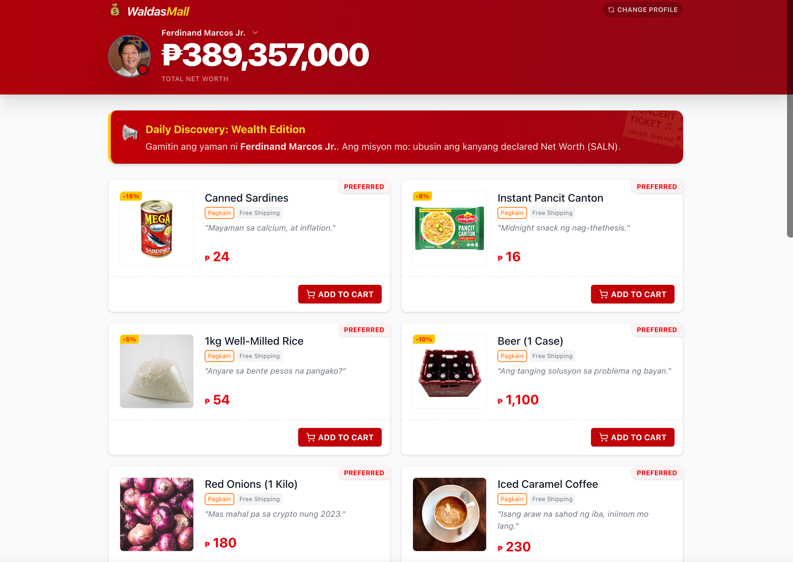

# 💰 Waldas Simulation

A satirical, educational simulation that visualizes the immense net worth of Philippine politicians by letting you "shop" with their funds.

> Built with React + Vite, TypeScript and Tailwind CSS. 




## Table of contents

- [Features](#features)
- [Quick Start](#quick-start)
- [Project structure](#project-structure)
- [Customization](#customization)
- [Contributing](#contributing)
- [License](#license)

## Features

- Interactive shopping spree where the budget equals a politician's declared net worth (SALN).
- Select from dynamic politician profiles; the app theme adapts to the selected profile's colors.
- Real-time wealth visualization (a "health-bar" style header that depletes as you spend).
- Societal impact receipt: converts spending into minimum wage labor years and estimates how many families could be fed with rice for a year.
- Optimized for mobile with responsive grid, sheet-style modals, and touch-friendly controls.

## Quick Start

Prerequisites

- Node.js and npm (or yarn)

Clone and install

```bash
git clone https://github.com/jnale-hub/waldas-simulation.git
cd waldas-simulation
npm install
```

Run dev server

```bash
npm run dev
# Open http://localhost:5173 in your browser
```

Build for production

```bash
npm run build
```

## Project structure

Key files and folders:

- `src/`
  - `App.tsx` — main controller and state management
  - `main.tsx` — app entry
  - `index.css` — global styles (Tailwind)
  - `components/` — reusable UI components
    - `Header.tsx` — status bar & budget display
    - `ProductCard.tsx` — item display with counters
    - `ReceiptModal.tsx` — checkout summary & impact calculation
    - `CartSummary.tsx` — floating cart bar
    - `PoliticianMenu.tsx` — character selection grid
  - `data/constants.ts` — static data: politicians & products
  - `lib/utils.ts` — helper functions (currency formatting, conversions)
  - `types.ts` — TypeScript types and interfaces

## Customization

### Adding a new politician

Edit `src/data/constants.ts` and add an entry to the `POLITICIANS` array.

### Adding new products

Add items to the `PRODUCTS` array in `src/data/constants.ts`. Use `category` to mark items as `Pang-masa` (mass-market) or `Luho` (luxury).

## Contributing

Contributions welcome. Suggested workflow:

1. Fork the repository
2. Create a feature branch: `git checkout -b feature/your-feature`
3. Commit changes: `git commit -m "Add feature"`
4. Push and open a PR

Please keep changes small and document any new data or theme properties.
